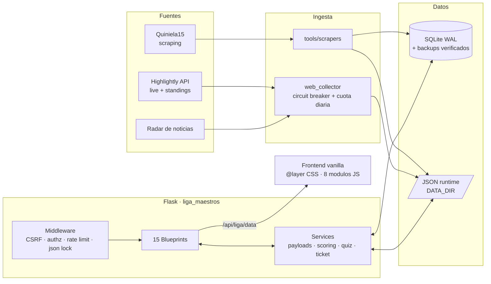
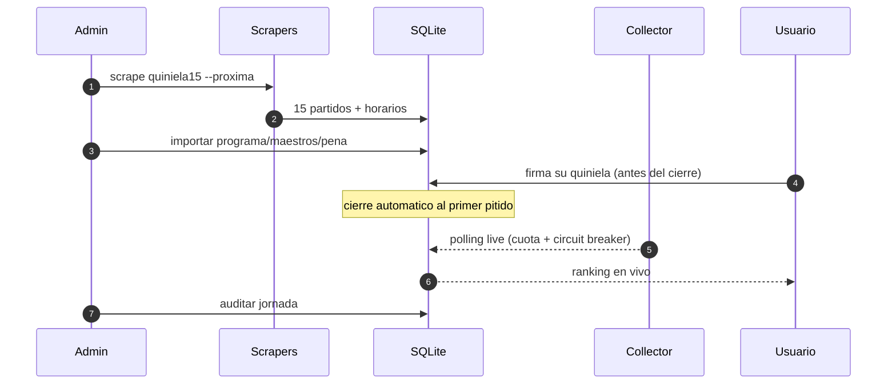

<h1 align="center">Liga de Maestros</h1>
<p align="center"><b>La Pe&ntilde;a contra los Maestros IA.</b> Quiniela competitiva humanos vs. modelos de IA, jornada a jornada.</p>
<p align="center">
  
  
  
  
  <a href="https://ligademaestros.alwaysdata.net"></a>
</p>

---

> **En una frase:** cada semana, 15 partidos de la quiniela; La Pe&ntilde;a (humanos) y los Maestros IA
> (GPT, Claude, Gemini, Grok…) firman su 1X2 antes del cierre, y la web arbitra en directo
> qui&eacute;n acierta m&aacute;s. Con ranking hist&oacute;rico, porra del pleno, quiz semanal y arcade.

---

## Qu&eacute; hace

| M&oacute;dulo | Descripci&oacute;n |
|---|---|
| **Quiniela** | Tabla de 15 partidos con predicciones 1X2 del Programa, los Maestros IA y La Pe&ntilde;a. Guardado, compartir y validaci&oacute;n server-side. |
| **Directo** | Seguimiento en vivo con datos de Highlightly: goles, tarjetas, resultados actualizados. Circuit breaker y cuota diaria de API. |
| **Ligas** | Clasificaci&oacute;n general, mensual y por jornada. Standings de Primera, Segunda y competiciones europeas. |
| **La Pe&ntilde;a** | Perfil del jugador: historial, rachas, rivales directos, galardones y comparaci&oacute;n contra la media. |
| **Quiz** | Preguntas de f&uacute;tbol con ranking propio y generaci&oacute;n semanal automatizada. |
| **Arcade** | Snake Gol, Arkanoid Liga y Maestros Invaders con rankings locales. |

## Arquitectura



## Quickstart

```bash
git clone https://github.com/Purplerave/liga-maestros-web.git
cd liga-maestros-web
python -m venv venv
source venv/bin/activate   # Linux/macOS
pip install -r requirements.txt
cp .env.example .env       # rellena las variables
python app.py
```

Abre `http://127.0.0.1:5000/`.

## Seguridad

- **CSRF** propio con tokens por sesi&oacute;n.
- **CSP** real (Content-Security-Policy) en todas las rutas.
- **Rate limiting** por IP en endpoints sensibles.
- **SQLite WAL** + `busy_timeout` + backups rotativos con `integrity_check`.
- **Borrado transaccional** de cuenta (GDPR).
- **pip-audit** bloqueante en CI + SHAs de GitHub Actions pineados.
- Vulnerabilidades: ver [SECURITY.md](SECURITY.md).

## Testing

```bash
python -m pytest -q          # 109 tests (seguridad, dominio, frontend)
ruff check .                # lint
```

## Estructura

```
app.py                         # Punto de entrada
liga_maestros/                 # Paquete principal
  routes/                      # 15 blueprints
  services/                    # Scoring, payloads, quiz, ticket
  middleware/                   # CSRF, auth, rate limit
  workers/                     # Collector live
tools/                         # Scripts de operacion
  scrapers/                    # Scrapeo de datos
  importers/                   # Importacion de jornadas
  ops/                         # Backups, inicializacion, collector
  audit/                       # Auditorias
static/                        # CSS, JS, imagenes
templates/                     # HTML (Jinja2)
data/                          # JSON publicos y semillas
tests/                         # Suite de tests
docs/                          # Documentacion
```

## Flujo semanal



## Licencia

[AGPL-3.0](LICENSE) &mdash; si clonas este repo como servicio cerrado, debes publicar tu codigo fuente.

## Contribuir

Ver [CONTRIBUTING.md](CONTRIBUTING.md) para setup, convenciones y proceso de PR.
