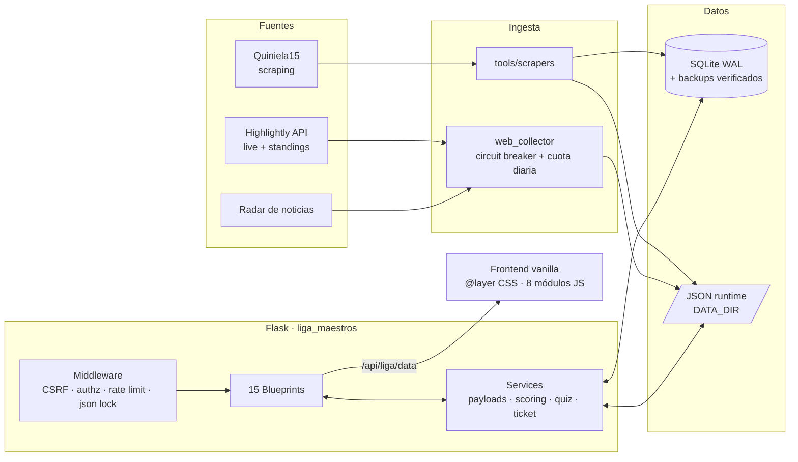
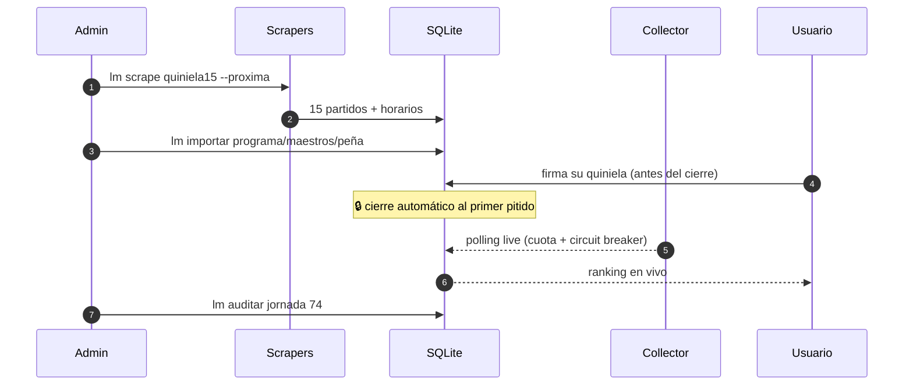

# 🔍 Auditoría Integral Maximalista — Liga de Maestros

> Rol del auditor: Diseñador de Producto Senior + Arquitecto de Software + Especialista en DX
> Fecha: 2026-07-25 · Commit base: `b7f6446` · Stack: Flask 3.1 + SQLite + JS vanilla (sin build)

---

## 0. Diagnóstico ejecutivo (la verdad sin anestesia)

**Lo que tienes es mejor de lo que parece desde fuera.** Por dentro hay una arquitectura seria:
blueprints bien separados, CSP real, CSRF propio, rate limiting, WAL + `busy_timeout`, backups
rotativos con `integrity_check`, borrado transaccional de cuenta, CI con `pip-audit` bloqueante y
SHAs de actions pineados. Eso está en el percentil alto de proyectos personales.

**El problema es que nada de eso se ve.** Un visitante del repo aterriza en un README de 3,5 KB sin
una sola imagen, rodeado de **17 archivos `.md` y 15 scripts `.py` en la raíz con nombres en
MAYÚSCULAS y en español**, dos `.bat` de Windows y un `J73.txt`. La primera impresión es "carpeta de
trabajo personal", no "producto". Estás vendiendo un Ferrari con la lona de una furgoneta encima.

| Dimensión | Nota | Comentario |
|---|---|---|
| Seguridad backend | **8,5 / 10** | Muy por encima de la media. Falta observabilidad y secretos rotables. |
| Arquitectura Python | **7 / 10** | Buena modularización, lastrada por duplicación root/paquete y I/O de JSON en caliente. |
| Frontend | **5 / 10** | 8 `<script>` globales sin módulos ni build; 15 K líneas de CSS con capas manuales. |
| Datos / persistencia | **5,5 / 10** | Híbrido SQLite + 27 JSON en disco sin contrato ni validación de esquema. |
| Testing | **6 / 10** | 1.457 líneas de tests, pero centrados en seguridad; falta cobertura de dominio y E2E. |
| DX / onboarding | **4 / 10** | Sin Makefile, sin devcontainer, sin pre-commit, sin `pyproject.toml`, raíz caótica. |
| Presentación / branding | **2,5 / 10** | README plano, sin capturas, sin badges, sin licencia, sin demo. |
| Comunidad / gobernanza | **2 / 10** | Sin LICENSE, sin CONTRIBUTING, sin plantillas de issue/PR, sin CODEOWNERS. |

**Puntuación global: 5,1 / 10 como *producto público*; 7,2 / 10 como *software*.**
La brecha entre esos dos números es exactamente donde está tu oportunidad.

---

# 🚀 BLOQUE 1 — Impacto Rápido (Quick Wins)

Cambios de menos de 1 hora cada uno con retorno desproporcionado. Ordenados por ratio impacto/esfuerzo.

### QW-1. Añade un `LICENSE` (5 min) — **crítico**
No hay licencia. Legalmente, **nadie puede usar, forkear ni contribuir a tu código**: por defecto
todos los derechos están reservados. GitHub además muestra "No license" como señal de alarma.
- Recomendación: **MIT** si quieres adopción máxima; **AGPL-3.0** si te preocupa que alguien clone
  tu web de quiniela y la explote como servicio cerrado. Para este proyecto, con datos y comunidad
  propios, **AGPL-3.0** es la elección estratégica.

### QW-2. Limpia la raíz del repositorio (30 min) — **el mayor cambio de percepción por euro**
Hoy la raíz tiene 39 entradas. Debería tener ~12. Propuesta de reorganización:

```
liga-maestros-web/
├── README.md  LICENSE  CHANGELOG.md  SECURITY.md  CONTRIBUTING.md
├── pyproject.toml  requirements.txt  Procfile  render.yaml  runtime.txt
├── app.py
├── liga_maestros/            # el paquete real (ya existe, bien)
├── tools/                    # ← TODOS los SCRIPTS_EN_MAYUSCULAS.py
│   ├── importers/            # IMPORTAR_PROGRAMA_JORNADA, IMPORTAR_QUIZ_JORNADA
│   ├── scrapers/             # SCRAPE_QUINIELA15_*, DESCARGAR_*
│   ├── ops/                  # GESTIONAR_BACKUPS, INICIALIZAR_PRODUCCION, EXPORTAR_SEMILLA
│   └── audit/                # AUDITAR_JORNADA_LIGA_MAESTROS, check_local_preds
├── docs/                     # ← TODOS los .md salvo los 5 canónicos
│   ├── operations/           # OPERACION_SEMANAL, DEPLOY_CONSOLA, README_DEPLOY, VARIABLES_ENTORNO
│   ├── design/               # AUDITORIA_UI_UX (33 KB), ROADMAP
│   └── ai/                   # README_COLABORACION_IA
└── .github/
```
Y **borra del repo**: `J73.txt`, `SEGUIMIENTO_J73.md`, `COMPROBAR_JORNADA.bat`, `PUBLICAR_WEB.bat`,
`check_local_preds.py`, `data/QUIZ_BANK_J72_*.json`, `data/horarios_J72.json`. Son artefactos
efímeros de una jornada concreta. (Ya tienes reglas de `.gitignore` para algunos… pero los ficheros
siguen versionados: el ignore no aplica a lo ya trackeado.)

### QW-3. Unifica los CLI bajo un solo comando (45 min)
Ya tienes `liga_maestros/cli/`. Consolida todo con `argparse` o Typer:
```bash
lm importar programa --jornada 74
lm scrape quiniela15 --directo
lm auditar jornada 74
lm backup create --reason pre-deploy
lm collector run --interval 60
```
15 puntos de entrada dispersos → 1. Esto solo ya sube la nota de DX de 4 a 7.

### QW-4. Elimina la triple duplicación `config.py` / `utils.py` / `scoring.py` (30 min)
Hoy existen en la raíz **y** en `liga_maestros/`, donde los del paquete son *wrappers* que
re-importan los de la raíz (`utils.py` del paquete es literalmente un re-export, y `config.py` del
paquete diverge del de la raíz). Esto es una bomba de relojería: dos fuentes de verdad para
configuración. Mueve el contenido real a `liga_maestros/config.py`, `liga_maestros/utils.py`,
`liga_maestros/scoring.py` y deja shims temporales en la raíz con `DeprecationWarning`, o elimínalos
si nada externo los importa (el CI los compila explícitamente — actualiza también esa lista).

### QW-5. Badges + hero en README (20 min)
Ver bloque 2. Es el cambio más visible de todos.

### QW-6. `pyproject.toml` + `ruff.toml` reales (20 min)
Hoy ruff se configura *inline en el YAML del CI* (`--select E,F,W --ignore E501,E741,F841`) y solo
sobre 3 rutas. Consecuencia: el linter **no mira `liga_maestros/`**, que es el 80 % del código.
Mueve la config a `pyproject.toml`, amplía a todo el repo, activa reglas `I` (isort), `B`
(bugbear), `UP` (pyupgrade), `S` (bandit) y añade `ruff format`.

### QW-7. Health check enriquecido y público (15 min)
Ya tienes `/api/live/health` con `build_sha`. Amplíalo a un contrato tipo:
```json
{"status":"ok","build_sha":"...","uptime_s":..., "db":{"ok":true,"size_mb":..,"wal_mb":..},
 "collector":{"running":true,"last_tick_s":42},"highlightly":{"calls_today":312,"circuit":"closed"},
 "jornada_activa":74,"deps":{"flask":"3.1.3"}}
```
Y expón `/metrics` en formato Prometheus (10 líneas con `prometheus_client`). Gratis: dashboards.

### QW-8. `.github/` completo (30 min)
`ISSUE_TEMPLATE/bug_report.yml`, `feature_request.yml`, `config.yml`, `PULL_REQUEST_TEMPLATE.md`,
`CODEOWNERS`, `FUNDING.yml`, `dependabot.yml` (pip + github-actions, semanal).

### QW-9. `data/` con contrato JSON Schema (40 min)
Tienes `data/quiz/quiz_schema.json` — perfecto, extiende ese patrón. Un test que valide los 27 JSON
contra su esquema evita la clase de bug más probable en este proyecto: un JSON mal formado en
producción que tumba la portada.

### QW-10. Corrige el patrón `get_db()` + `conn.close()` (20 min)
En `routes/main.py::index` haces `conn = get_db()` … `finally: conn.close()`, pero `get_db()`
registra la conexión en `g._managed_db_conns` y `teardown_request` la vuelve a cerrar. Cerrar a mano
una conexión gestionada por `g` significa que la siguiente llamada a `get_db()` en la misma request
recibe un objeto cerrado (lo salvas con el `SELECT 1` de sondeo, pero es un parche). Decide **una**
semántica: o context manager explícito, o gestión por `g`. Nunca las dos.

---

# 🎨 BLOQUE 2 — Rediseño Visual y Documentación

## 2.1 La portada del repo: de "carpeta" a "producto"

Un README de élite se lee en 8 segundos y responde: *¿qué es? ¿cómo se ve? ¿por qué me importa?
¿cómo lo pruebo?* El tuyo hoy responde solo al cuarto.

### Estructura propuesta (nivel Top 1 %)

```markdown
<p align="center">
  
</p>

<h1 align="center">Liga de Maestros</h1>
<p align="center"><b>La Peña contra los Maestros IA.</b> Quiniela competitiva humanos vs. modelos, jornada a jornada.</p>

<p align="center">
  <a href="…"></a>
  
  
  
  
  <a href="https://ligademaestros.alwaysdata.net"></a>
</p>

<p align="center"></p>

---
> **En una frase:** cada semana, 15 partidos; La Peña (humanos) y los Maestros IA
> (GPT, Claude, Gemini, Grok…) firman su 1X2 antes del cierre, y la web arbitra en directo
> quién acierta más. Con ranking histórico, porra del pleno, quiz semanal y arcade.
```

Secciones, en este orden exacto:
1. **Hero** (banner + tagline + badges + GIF) — 8 s para enamorar.
2. **✨ Qué hace** — 6 bullets con emoji, uno por módulo: Quiniela, Directo, Ligas, La Peña, Quiz, Arcade.
3. **📸 Galería** — tabla 2×2 de capturas (`<table>` con ``): Portada, Quiniela compacta, Directo, Ranking.
4. **🏗️ Arquitectura** — diagrama Mermaid (abajo).
5. **⚡ Quickstart** — 4 líneas, con tabs Linux/macOS/Windows en `<details>`.
6. **🔁 Flujo semanal** — tu contenido actual, pero como Mermaid de estados.
7. **🧪 Calidad y seguridad** — presume: CSP, CSRF, rate limit, WAL, backups verificados, pip-audit bloqueante, SHAs pineados. **Esto hoy no lo cuentas y es tu mayor activo.**
8. **🗺️ Roadmap** — 3 bullets + link.
9. **🤝 Contribuir · 📄 Licencia · 🙌 Créditos**.

### Diagrama de arquitectura (pégalo tal cual)



Y un diagrama de secuencia de la jornada (va en `docs/operations/`):


## 2.2 Activos gráficos que debes crear (`docs/assets/`)

| Activo | Formato | Cómo |
|---|---|---|
| `banner.png` | 1600×500, dark, wordmark + "La Peña vs Maestros IA" | Ya tienes `liga_maestros_wordmark.svg`: componer sobre el fondo del hero. |
| `demo.gif` | ≤ 8 s, ≤ 5 MB, 1200 px | Grabar: portada → quiniela → marcar 1X2 → guardar → directo actualizándose. Con `ffmpeg -vf palettegen` para peso mínimo. |
| `shot-*.png` | 4 capturas en mockup de navegador | Marcos con [shots.so] / [screely]; sombra suave sobre fondo `#06090f`. |
| `social-preview.png` | 1280×640 | **Súbelo en Settings → Social preview.** Hoy cuando compartes el repo en X/Slack no sale nada. |
| `logo-mark.svg` | ya existe | Úsalo también como avatar de la organización. |
| Tema oscuro/claro en README | `<picture>` con `prefers-color-scheme` | Detalle de artesano que se nota. |

## 2.3 Documentación: de 17 markdowns sueltos a un sitio

Tienes ~90 KB de documentación excelente (`AUDITORIA_UI_UX.md` de 33 KB, `OPERACION_SEMANAL.md`,
`README_COLABORACION_IA.md`) **enterrada en la raíz**. Publícala:

- **MkDocs Material** + `mkdocs-mermaid2` → GitHub Pages en `docs.ligademaestros.*`.
  Un workflow de 15 líneas. Búsqueda, navegación, dark mode, y de golpe pareces un proyecto con
  equipo detrás.
- Añade **ADRs** (`docs/adr/0001-sqlite-en-vez-de-postgres.md`, `0002-vanilla-js-sin-build.md`,
  `0003-json-en-disco-como-cache-de-live.md`). Documentar *por qué* elegiste algo vale más que
  documentar *qué* hiciste, y te blinda ante el "¿por qué no usas React?".
- **README multilingüe**: `README.md` (ES) + `README.en.md`. Duplicas la audiencia potencial.
- Un `docs/GLOSARIO.md`: *jornada, pleno, La Peña, Maestro, porra, ticket, Q15*. Nadie de fuera
  entiende tu dominio sin esto, y es la barrera #1 para que alguien contribuya.

## 2.4 Diseño de producto (UI)

Ya tienes un sistema visual serio (tokens, `@layer`, tema "newspaper", tipografías). Lo que le falta:

1. **Nada de esto está documentado visualmente.** Monta un `/styleguide` (ruta Flask que renderiza
   todos los componentes) o Storybook-lite. Es la única forma de que el CSS no se degrade.
2. **`prefers-reduced-motion`** y auditoría de contraste AA/AAA — tienes `interactions.css`, revisa.
3. **Skeletons en lugar de spinners** para `/api/liga/data` (payload gordo: partidos + standings +
   multi-league + predicciones + live, todo en una sola llamada).
4. **Modo espectador / TV**: pantalla de ranking a 1080p para proyectar durante la jornada. Es la
   feature más "wow" barata que existe para un proyecto de peña.
5. **Vista móvil primero para el Directo** — es donde se consume el 90 % del tiempo real.
6. **Micro-celebraciones**: cuando un usuario clava el pleno, confetti + toast. Retención pura.

---

# 🛠️ BLOQUE 3 — Optimización de Código y Arquitectura

## 3.1 Deuda técnica prioritaria (P0)

**A. Duplicación de módulos root ↔ paquete** (ver QW-4). Dos `config.py` divergentes es el bug de
producción que aún no ha ocurrido.

**B. `/api/liga/data` es un god-endpoint.** En una sola petición construyes: partidos, standings,
all-league-matches, live-matches, multi-league-standings, match-info, close-info, predicciones,
ranking y logos. Problemas: latencia acoplada al peor componente, imposible cachear por partes,
imposible invalidar granularmente.
- **Fase 1 (barata):** añade `?include=matches,predictions` para que el cliente pida solo lo que usa.
- **Fase 2:** divide en `/api/jornada/{j}/matches`, `/predictions`, `/ranking`, `/standings`, cada uno
  con su `ETag` + `Cache-Control` propio. El frontend ya tiene `state.js`, encaja bien.
- **Fase 3:** `/api/live/stream` con **SSE** en lugar de polling. Menos llamadas, UI instantánea.

**C. I/O de disco síncrona en el hot path.** `safe_read_json` se llama en requests (ticker, Q15,
logos, horarios, reasons). Con gunicorn a 1 worker × 8 threads, cada lectura bloquea. Solución:
caché en memoria con invalidación por `mtime` (`functools.lru_cache` + comprobación de `st_mtime`,
o un pequeño `JsonStore` con TTL). Ganancia estimada: 30-60 ms por request en la portada.

**D. `_get_assets_version()` recorre `static/` entero.** Está cacheado con `lru_cache(1)`, bien —
pero eso significa que **en desarrollo nunca se invalida** hasta reiniciar, y en producción hace un
`os.walk` de 3,7 MB en el primer request tras el arranque (cold start visible). Mejor: usar el
`build_sha` de despliegue como versión (ya lo tienes en `/health`) y caer al `walk` solo en local.

**E. Cache-busting manual y frágil.** En `liga_index.html` hay 20 sufijos escritos a mano:
`'-cover-hero-15'`, `'-ui-quiniela-36'`, `'-typewriter-7'`… Cada cambio de CSS exige recordar
incrementar un número. Sustitúyelo por hash de contenido por fichero (`sha1[:8]` calculado al
arrancar y guardado en un manifest). Elimina una clase entera de bugs de "no me sale el cambio".

## 3.2 Frontend: el eslabón débil

- **8 `<script defer>` globales sin `type="module"`.** Todo el estado vive en globals implícitos.
  Migra a ES modules nativos (`<script type="module" src="js/main.js">`) — **no necesitas bundler**,
  los navegadores modernos lo soportan; y así obtienes imports explícitos, tree-shaking mental y
  `node --check` deja de ser tu único test de sintaxis.
- **Añade un `package.json`** aunque no compiles nada: te da ESLint + Prettier + Stylelint +
  `npm run lint` en CI. Hoy el CI hace `node --check` de **2 de los ~20 ficheros JS**. Es casi nada.
- **15.366 líneas de CSS** para una SPA de 6 vistas es mucho. Hay solapamiento evidente:
  `ticket.css` (1168) + `ticket_compact.css` (387) + `themes/newspaper/ticket_compact.css` (300) +
  `themes/newspaper/ticket_readability.css`. Pasa **PurgeCSS en modo report** y mide el CSS muerto;
  apuesto por un 25-35 %.
- **Sin bundling → 20 requests CSS + 8 JS en la portada.** Con HTTP/2 duele menos, pero un
  `esbuild` opcional (30 líneas) que concatene y minifique para producción bajaría el LCP
  notablemente. Mantén el modo sin build para desarrollo.
- **Añade Lighthouse CI** al workflow con presupuestos (`performance ≥ 90`, `a11y ≥ 95`). Te da un
  badge y disciplina automática.

## 3.3 Backend: subir de "bueno" a "excelente"

| Tema | Estado | Propuesta |
|---|---|---|
| Tipado | Casi ausente | `mypy --strict` progresivo, empezando por `services/scoring.py` y `services/payloads/`. Es donde un `None` inesperado corrompe un ranking. |
| Modelos de datos | Dicts crudos por todas partes | **Pydantic v2** para los payloads de API y para validar los JSON de `data/`. Te da validación + docs OpenAPI gratis. |
| Errores | `except Exception: pass` en varios sitios (`live.py`, `main.py`, `connection.py`) | Excepciones de dominio (`JornadaNoEncontrada`, `CuotaAgotada`) + logging estructurado. Los `pass` silenciosos son deuda invisible. |
| Logging | `logging` básico | JSON structured logging (`structlog`) + `request_id` en `g` propagado a la respuesta. Imprescindible para depurar en Alwaysdata. |
| Observabilidad | Ninguna | **Sentry** (free tier) + `/metrics` Prometheus + Uptime Kuma o Better Stack contra `/api/live/health`. Coste: 0 €. Valor: enorme. |
| Config | `os.getenv` disperso en 40+ sitios | Un único `Settings` con `pydantic-settings`: tipado, validado al arrancar, documentado y auto-generador de `.env.example`. |
| Migraciones | `run_startup_migrations()` casero | Funciona, pero versiona explícitamente (`schema_version` + migraciones numeradas idempotentes) y añade un test que aplique todas desde DB vacía. |
| Concurrencia | `write_json_locked` casero | Correcto para 1 worker. **Si algún día pasas a 2+ workers, se rompe.** Documéntalo como restricción explícita (ADR) o mueve el estado live a SQLite. |
| Escalado DB | SQLite | Es la decisión correcta hoy. Pero abstrae el acceso tras un repositorio (`repositories/predictions.py`) para que el día que necesites Postgres sea un cambio de una capa, no de 46 `execute()` esparcidos por los blueprints. |
| Cuota de API | Circuit breaker + límite diario ✅ | Muy bien resuelto. Expón el estado en la UI de admin: "quedan 7.188 llamadas hoy". |

## 3.4 Testing: de 1.457 líneas a una red de seguridad real

Tu suite es fuerte en seguridad (`test_security_hardening`, `test_game_security`,
`test_production_readiness`) y flaca en **dominio**. Lo que falta:

1. **Property-based testing con Hypothesis sobre `scoring.py`.** El scoring es el corazón del
   producto: si puntúa mal, el proyecto pierde toda credibilidad. Genera resultados aleatorios y
   verifica invariantes (puntos ≥ 0, monotonía, pleno nunca > máximo).
2. **Golden tests del payload**: snapshot de `/api/liga/data` para una jornada fixture. Detecta
   regresiones de contrato al instante.
3. **Tests de migración desde DB vacía** (ya casi lo cubre `INICIALIZAR_PRODUCCION`, formalízalo).
4. **E2E con Playwright**: 5 escenarios (login, firmar quiniela, cierre bloquea edición, ver
   directo, ver ranking). Corre en CI en headless. Es la diferencia entre "creo que funciona" y
   "sé que funciona".
5. **`pytest-cov` con umbral** (`--cov-fail-under=70`) + badge de Codecov.
6. **`schemathesis`** contra tu OpenAPI (cuando lo generes) para fuzzing gratis de la API.

## 3.5 Entorno y dependencias

- `requirements.txt` está pineado ✅ pero sin hashes. Añade `pip-compile` (`pip-tools`) con
  `--generate-hashes` → builds reproducibles y a prueba de supply-chain.
- Separa `requirements-dev.txt` (pytest, ruff, mypy, playwright).
- **Devcontainer** (`.devcontainer/devcontainer.json`): un clic en Codespaces y el proyecto arranca.
  Para un proyecto con 20 variables de entorno, esto es transformador.
- **Dockerfile + docker-compose** con volumen para `DATA_DIR`. Aunque despliegues en Alwaysdata,
  tener imagen te da portabilidad y reproducibilidad instantáneas.
- **Makefile** (o `justfile`):
  `make setup · make run · make test · make lint · make fmt · make audit · make seed · make deploy`.
  Cinco minutos de trabajo, y el onboarding pasa de 20 min a 2.
- **pre-commit**: ruff, ruff-format, `detect-secrets`, `check-json`, `end-of-file-fixer`,
  `no-commit-to-branch`. Mata los problemas antes del CI.

---

# 💡 BLOQUE 4 — Nuevas Funcionalidades (Roadmap de Futuro)

Ordenadas por *potencial de convertir esto en un producto del que la gente habla*.

## 🥇 Tier S — Las que cambian la naturaleza del proyecto

### 1. 🤖 Arena de IAs automatizada y auditable
Hoy los "Maestros IA" se importan a mano con `IMPORTAR_PROGRAMA_JORNADA.py`. **Automatízalo y
conviértelo en el corazón del producto:**
- Conector multi-proveedor (OpenAI, Anthropic, Google, xAI, DeepSeek, Mistral + un modelo local vía
  Ollama) con un prompt idéntico y un contexto idéntico (clasificación, lesiones, forma, histórico).
- **Sella cada predicción con hash + timestamp** antes del cierre. Publica el hash. Verificabilidad
  criptográfica de que ninguna IA "predijo" a posteriori. Esto es *el* diferenciador narrativo:
  *"la única liga de IAs con predicciones sellables"*.
- Guarda el **razonamiento** de cada modelo (ya tienes `PREDICTION_REASONS.json`) y muéstralo al
  desplegar el partido. La gente vendrá solo por leer cómo se equivoca Grok.
- **Leaderboard histórico de modelos** con métricas serias: accuracy, Brier score, log-loss,
  calibración, ROI simulado contra cuotas. Publica un `docs/benchmark.md` autogenerado cada jornada.
  **Esto solo puede darte prensa técnica.** Es un benchmark público de LLMs en un dominio real,
  medible, semanal e irrepetible.

### 2. 📊 API pública + dataset abierto
Llevas 74 jornadas de predicciones humanos-vs-IA. **Eso es un dataset que no existe en ningún sitio.**
- `GET /api/v1/jornadas/{j}` público, con OpenAPI/Swagger UI, rate limit y API keys.
- Export a CSV/Parquet + publicación en **Hugging Face Datasets** con licencia CC-BY.
- Un notebook de análisis en `research/` con las conclusiones. Esto atrae a una audiencia
  completamente distinta (data scientists) que ni sabe que existes.

### 3. 🔴 Directo en tiempo real de verdad (SSE/WebSocket)
Sustituye el polling por Server-Sent Events. Añade:
- **Ticker de eventos** (gol, roja, VAR) con animación y sonido opcional.
- **"Win probability" en vivo** por usuario: *"si el Betis empata, subes al 2.º puesto"*.
  Recalculado en cada gol. Es la feature que hace que nadie cierre la pestaña.
- **Modo TV/proyector** a pantalla completa.

### 4. 🏆 Ligas privadas multi-peña (multi-tenant)
Hoy es *tu* peña. Convertirlo en producto: cualquiera crea su liga con un código de invitación,
importa la quiniela oficial automáticamente y compite con sus amigos **contra tus Maestros IA
compartidos**. Escala de 20 usuarios a 20.000 sin cambiar el modelo de datos radicalmente
(añadir `league_id` a las tablas clave).

## 🥈 Tier A — Alto impacto, esfuerzo medio

5. **Bot de Telegram/WhatsApp**: recordatorio de cierre, "tu quiniela va 8/15", resultados al final,
   y **firmar la quiniela desde el chat**. La retención de un proyecto de peña vive o muere aquí.
6. **PWA completa**: ya tienes `manifest.webmanifest` — añade Service Worker con offline shell y
   **Web Push** para el aviso de cierre. Instalable en el móvil = app sin App Store.
7. **Perfil público del jugador** (`/u/{id_opaco}`): racha, mejores jornadas, nemesis-team,
   comparación contra cada IA, y **tarjeta OG generada dinámicamente** para compartir en redes.
   Crecimiento viral orgánico y gratis.
8. **Logros / badges** (gamificación): "Clavó el pleno", "Ganó a las 5 IAs", "10 jornadas seguidas",
   "Profeta del descenso". Con animación de desbloqueo.
9. **Resumen semanal automático generado por IA**: crónica en tono periodístico de la jornada
   (encaja perfecto con tu tema visual "newspaper"), publicada como post y enviada por email.
   Tu identidad de diseño ya es un periódico — **hazlo literal**.
10. **Panel de administración web** que sustituya los 15 scripts CLI: importar jornada, revisar
    horarios, forzar refresh, ver cuota de API, lanzar auditoría, gestionar backups. Todo con
    confirmación y log de acciones. Tu "operación semanal" pasaría de 30 min a 3.
11. **Histórico navegable y comparador**: seleccionar dos jornadas o dos participantes y ver
    diferencias, con gráficas (Chart.js o SVG puro para no añadir peso).
12. **Modo "¿Y si?"** (sandbox): el usuario cambia resultados hipotéticos y ve cómo quedaría el
    ranking. Adictivo, barato de implementar (todo es cliente) y muy compartible.

## 🥉 Tier B — Guinda y experimentos

13. **Comentarios en vivo por partido** (ya tienes `routes/comments.py`) → chat de jornada con
    moderación y reacciones.
14. **Apuestas ficticias con moneda virtual** ("Maestrocoins") — sin dinero real, cero problema legal,
    máxima diversión. Mercado interno, cuotas derivadas del consenso de la Peña.
15. **Quiz elevado**: ya tienes pipeline (`data/quiz/` con sources→generated→approved/rejected +
    schema). Añade duelos 1v1, contrarreloj y ranking de quiz separado.
16. **Arcade con leaderboard global y torneos semanales** (Snake Gol, Invaders, Arkanoid ya existen —
    están infrautilizados: dales una portada propia y premios de puntos para la liga).
17. **Integración con calendario** (`.ics`): partidos y cierre de la jornada en tu Google Calendar.
18. **Widget embebible** (`<iframe>` / web component) con el ranking, para blogs de peñas.
19. **Modo "fantasy"**: elige 3 IAs como tu alineación semanal y hereda sus aciertos. Meta-juego
    sobre el juego.
20. **Alexa/Google Home skill**: "¿cómo va mi quiniela?". Puro efecto demo, y sorprendentemente barato.

---

# 🤖 BLOQUE 5 — Automatización y Ecosistema GitHub

## 5.1 Lo que ya está bien (no lo toques)
- SHAs de actions pineados ✅ (raro y excelente).
- `pip-audit` bloqueante ✅.
- Guard contra ficheros sensibles trackeados ✅.
- Deploy con releases inmutables + symlink `current` + backup pre-deploy + verificación de
  `build_sha` público ✅. **Esto es un pipeline de nivel profesional.**

## 5.2 Lo que falta

| Workflow | Qué hace | Prioridad |
|---|---|---|
| `lint.yml` | ruff (todo el repo) + ruff-format + mypy + ESLint + Stylelint | 🔴 Alta |
| `test.yml` | pytest + coverage + matriz Python 3.11/3.12 + upload a Codecov | 🔴 Alta |
| `e2e.yml` | Playwright contra la app levantada con DB semilla | 🟠 Media |
| `codeql.yml` | CodeQL (Python + JS) — gratis y da badge de seguridad | 🔴 Alta |
| `dependabot.yml` | pip + actions, agrupado, semanal | 🔴 Alta |
| `release.yml` | Semantic-release: tag + CHANGELOG + GitHub Release automáticos desde Conventional Commits | 🟠 Media |
| `docs.yml` | MkDocs → GitHub Pages | 🟠 Media |
| `lighthouse.yml` | Lighthouse CI con presupuestos sobre el deploy | 🟡 Baja |
| `jornada.yml` | **Cron semanal** que ejecuta scrape de la próxima jornada, pide predicciones a las IAs, valida y **abre un PR con los datos**. Tu operación semanal automatizada y auditable en Git. | 🔴 Alta (killer) |
| `backup-verify.yml` | Cron diario: descarga último backup, `integrity_check`, avisa si falla | 🟠 Media |
| `stale.yml` / `labeler.yml` | Higiene de issues y etiquetado automático por rutas | 🟡 Baja |

> **`jornada.yml` es la joya.** Convierte tu proceso manual de 30 minutos en un PR automático que
> revisas en 2 minutos desde el móvil. Y deja rastro en Git de cada predicción con timestamp
> verificable — lo que refuerza directamente la propuesta de valor del punto Tier-S #1.

## 5.3 Comunidad y gobernanza (crear todo)
- `LICENSE` (AGPL-3.0 recomendada) — **bloqueante**.
- `CONTRIBUTING.md`: setup, estándares de código, Conventional Commits, cómo correr tests, cómo
  proponer una feature.
- `CODE_OF_CONDUCT.md` (Contributor Covenant 2.1).
- `.github/ISSUE_TEMPLATE/*.yml` en formato *forms* (no markdown): `bug`, `feature`, `jornada-error`
  (específico de tu dominio: "un resultado está mal").
- `PULL_REQUEST_TEMPLATE.md` con checklist (tests, docs, capturas si hay UI).
- `CODEOWNERS`, `FUNDING.yml`, `SUPPORT.md`.
- **Discussions activado** con categorías: Ideas, Predicciones de la jornada, Mostrar y contar.
- **GitHub Projects** con el roadmap público. Vender transparencia es vender confianza.
- **Topics del repo**: `flask`, `python`, `quiniela`, `llm-benchmark`, `football`, `sqlite`,
  `ai-vs-human`, `spanish-football`. Hoy probablemente no tienes ninguno; es descubribilidad gratis.
- **Social preview image** en Settings.
- Un **`SECURITY.md`** ya lo tienes ✅ — enlaza a él desde el README.

---

# 🗓️ Plan de ejecución sugerido

### Sprint 0 — "La portada" (1 fin de semana, impacto máximo)
`LICENSE` → limpieza de raíz → banner + GIF + capturas → README nuevo → badges →
social preview → topics → plantillas `.github/` → `dependabot.yml`.
**Resultado: el repo pasa de 2,5/10 a 8/10 en presentación sin tocar una línea de lógica.**

### Sprint 1 — "Los cimientos" (1 semana)
`pyproject.toml` + ruff global + mypy inicial → eliminar duplicación root/paquete → CLI unificado
→ Makefile + pre-commit → `requirements-dev.txt` → CodeQL + coverage.

### Sprint 2 — "El rendimiento" (1-2 semanas)
Caché de JSON por `mtime` → cache-busting por hash → trocear `/api/liga/data` con ETags →
JS a ES modules → auditoría de CSS muerto → Lighthouse CI.

### Sprint 3 — "El producto" (continuo)
`jornada.yml` automatizado → conectores multi-LLM con predicciones selladas → leaderboard de
modelos con Brier score → SSE en directo → bot de Telegram → PWA con push.

### Sprint 4 — "La ambición"
API pública + dataset en Hugging Face → ligas privadas multi-tenant → perfiles públicos con tarjetas
OG → benchmark publicado.

---

## Una última reflexión de producto

Tienes entre manos **dos productos distintos** dentro del mismo repositorio:

1. **La web de la peña** — nicho, cariñosa, con su tema de periódico y su arcade. Preciosa.
2. **Un benchmark público, longitudinal y verificable de LLMs prediciendo fútbol real.**

El segundo es, con diferencia, el más valioso y el que nadie más está haciendo bien. 74 jornadas de
histórico son un foso competitivo que no se compra con dinero, solo con tiempo — y tú ya lo has
pagado. Todo lo que hagas para hacer ese ángulo **visible, verificable y consultable por API** es lo
que separa "un proyecto personal muy bien hecho" de "un proyecto del que se habla en Hacker News".

El código ya está a la altura. Lo que falta es contarlo.
